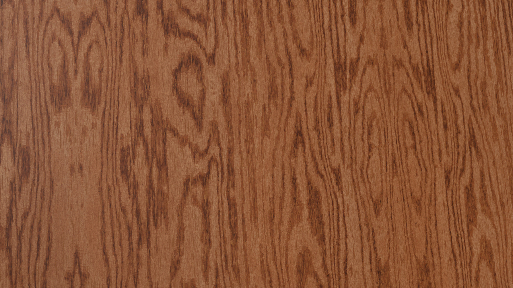
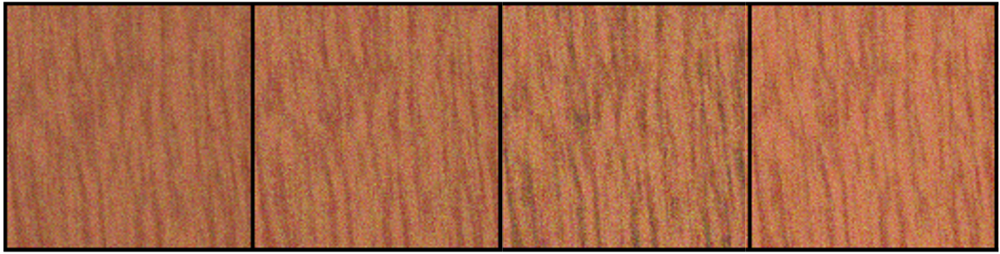
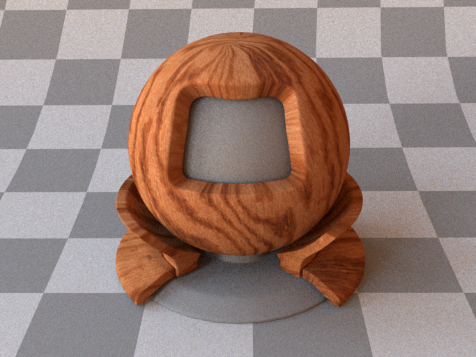
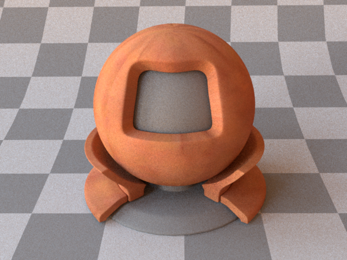
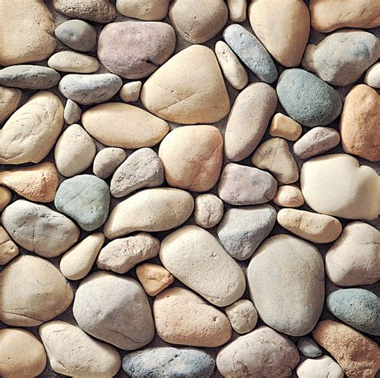
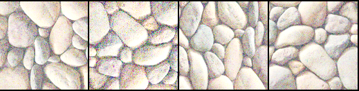
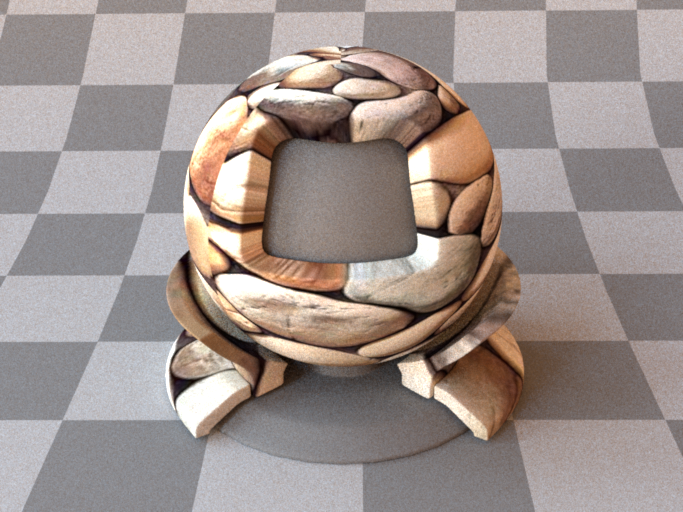
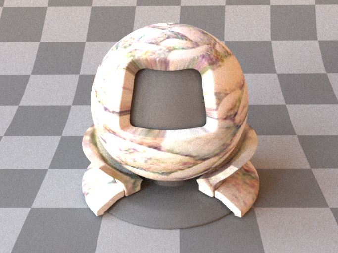

This repository contains the PyTorch implementation of the Dimensionally Extending Textures solution based on GramGAN. 

# Results
Some texture results are shown below. Training the model takes several days on a single NVIDIA GeForce RTX 4060 GPU and still not enough since the quality of slice results is not very good.

## Wood texture exemplar

### 2D slices of the resulting 3D texture

### 3D rendering 

## Marble texture exemplar

### 2D slices of the resulting 3D texture

### 3D rendering 

